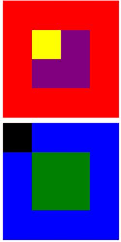

# Posicionando cajas

1. Autora: Melissa Yauri

2. Objetivo  
El presente trabajo consta en aplicar los conocimientos sobre "positioning". De manera que repliquen la imagen adjuntada.
3. Herramientas   
 -Html   
 -Css

4. Imagen  

